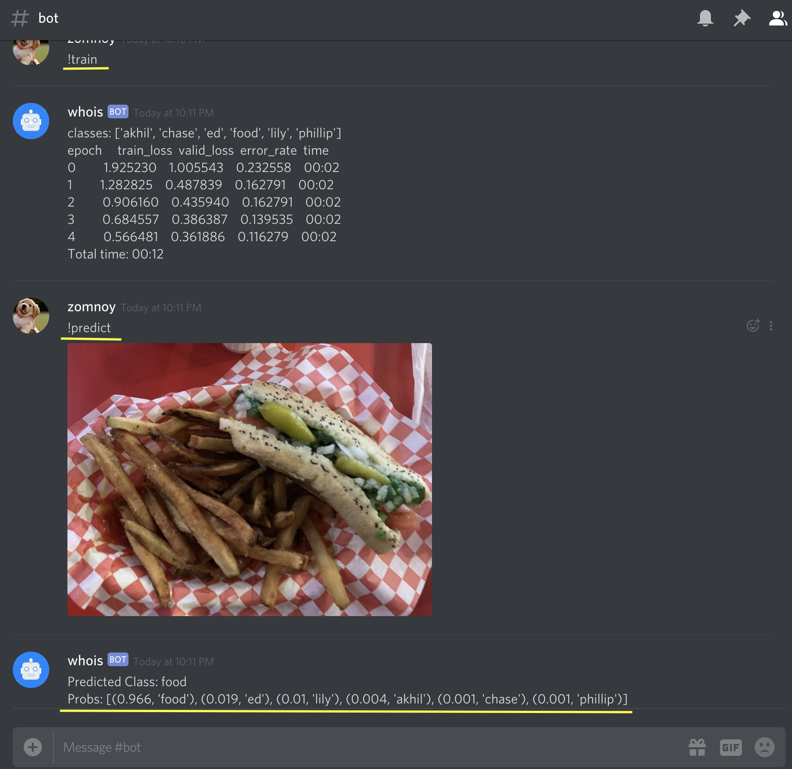

# Discord Classifier

## Supports
- Training ( !train )
- Inference ( !predict \<image> )
- Adding your own images ( !add \<class> \<image> )

### Full command list
- !help - You are looking at it
- !add - \<class> \<attachment> - Add an image for training
- !undo - Undo the previous add
- !ls - View the current classes and the number of images per class
- !train - Train the model using the added images
- !predict - \<attachment> - Predict the class of <attachment> using the last trained model. You may omit !predict for this command.
- !cm - Display a confusion matrix on the validation set
- !toploss - Display a heatmap of the top losses in the validation set
- !debug - sends debug information